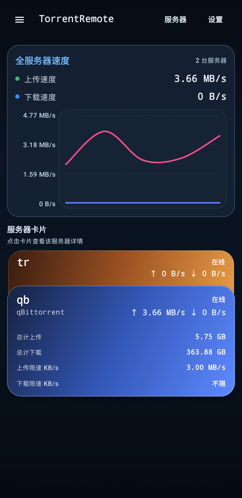
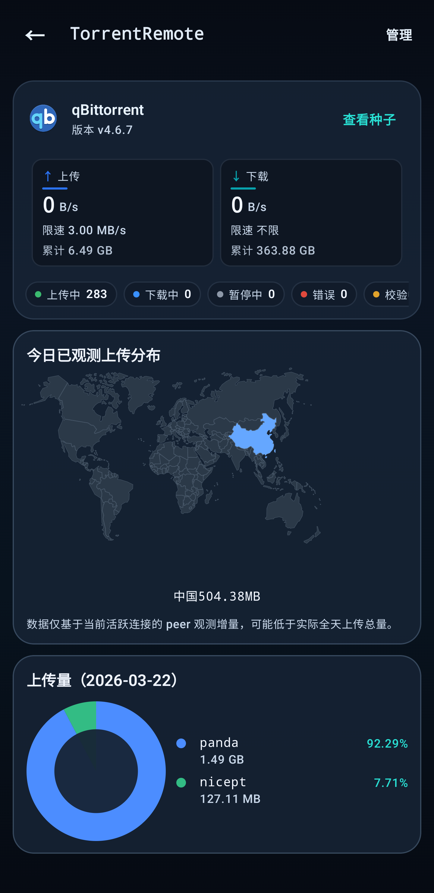
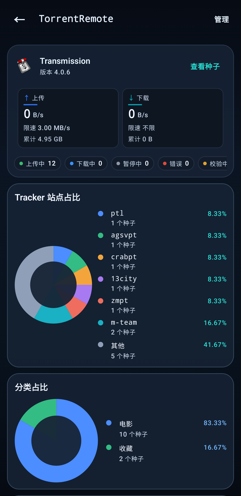
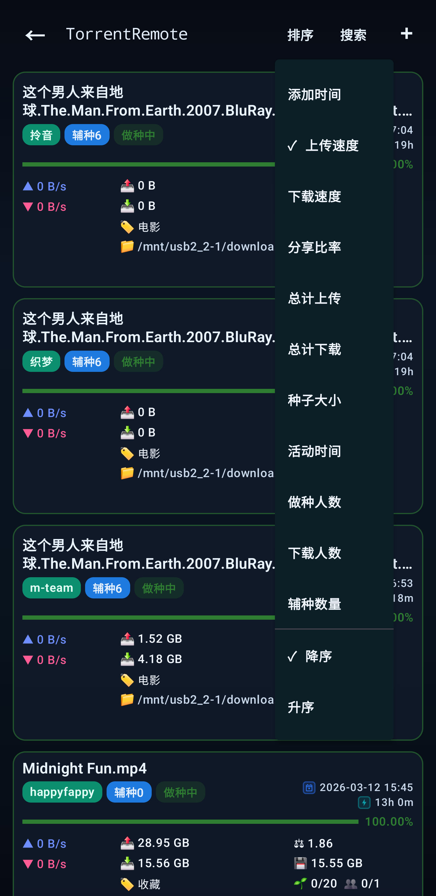
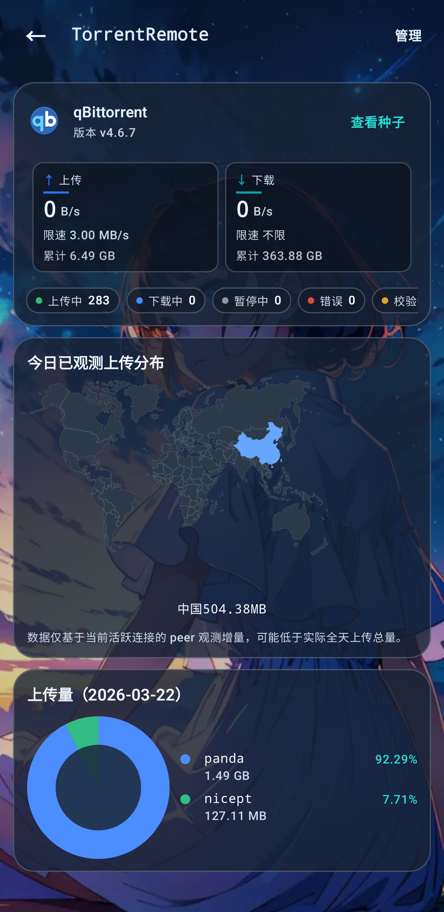
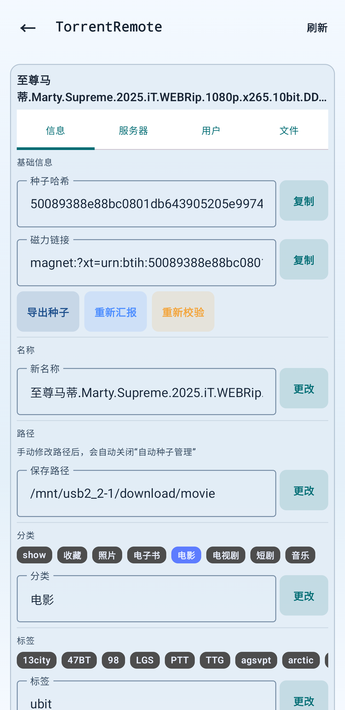
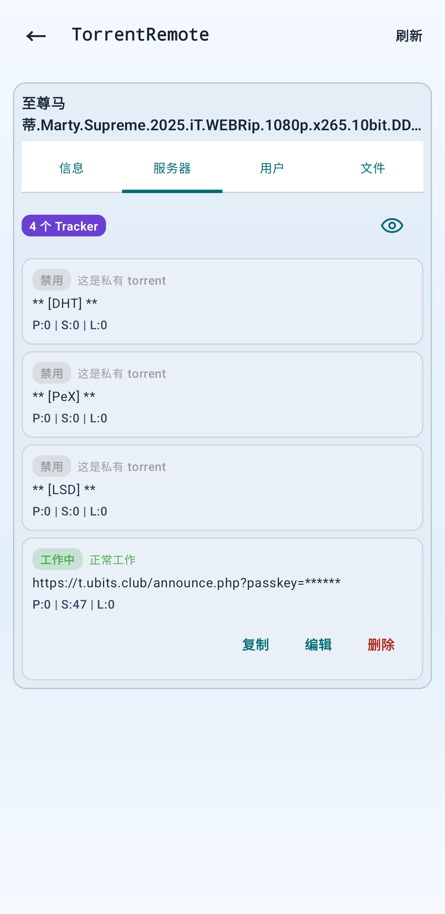

# qbitremote / TorrentRemote

`TorrentRemote` 是一个用于远程管理 qBittorrent 与 Transmission 服务器的 Android 应用。

`TorrentRemote` is an Android app for remotely managing both qBittorrent and Transmission servers.

[中文](#zh-cn) | [English](#en)

<a id="zh-cn"></a>

## 中文

### 项目简介

`TorrentRemote` 聚焦多服务器远程管理体验，支持在一台手机上统一查看首页总览、服务器卡片、种子列表和种子详情，并兼顾 qBittorrent 与 Transmission 两套后端。

### 核心功能

- 同时支持 qBittorrent WebUI API 与 Transmission RPC
- 多服务器配置保存、快速切换与独立缓存快照
- 首页全服务器实时上下行速度曲线与服务器卡片总览
- 服务器仪表盘图表，包括国家、分类、标签、站点和状态分布
- 种子列表搜索、排序、跨页返回定位与快速回顶
- 种子详情页支持信息、服务器、用户、文件四个页签
- Tracker 复制、编辑、删除，以及 passkey 隐藏/显示
- 重新汇报、重新校验、分类/标签修改、限速、分享率等常用操作
- 文件树浏览、文件夹优先展示与更稳定的前后台恢复体验
- 中英文、本地主题、Google Play 资源与自适应图标

### 当前版本

- App 名称：`TorrentRemote`
- Application ID：`com.hjw.qbremote`
- 版本：`0.1.11`
- Version Code：`12`
- Min SDK：`26`
- Target / Compile SDK：`35`

### 支持的后端

- qBittorrent WebUI API
- Transmission RPC

### 截图预览

<p align="center">
  
  
  
</p>
<p align="center">
  
  
  
</p>
<p align="center">
  
</p>

### 构建与发布

仓库内已经包含本地 Android 工具链，位于 `tools/android-build/`。

Debug 构建：

```powershell
.\gradlew.bat assembleDebug
```

固定签名的 Google Play Release AAB：

```powershell
.\scripts\build-release-aab.ps1
```

固定签名的 Release APK：

```powershell
.\gradlew.bat assembleRelease
```

关键产物路径：

- Debug APK：`app/build/outputs/apk/debug/app-debug.apk`
- Release APK：`app/build/outputs/apk/release/app-release.apk`
- Release AAB：`app/build/outputs/bundle/release/app-release.aab`
- 分发目录：`release-artifacts/`

### Google Play 资源

- 512 图标：`play-assets/icon/qbitremote-play-icon-512.png`
- 1024 源图：`play-assets/icon/qbitremote-play-icon-1024.png`
- 发布清单文档：[Google Play Release Checklist (zh-CN)](docs/google-play/PLAY_RELEASE_CHECKLIST.zh-CN.md)

### 许可证

详见 [LICENSE](LICENSE)。

<a id="en"></a>

## English

### Overview

`TorrentRemote` is designed for multi-server mobile torrent management. It brings home dashboard insights, server cards, torrent browsing, and detailed per-torrent actions into one Android app while supporting both qBittorrent and Transmission.

### Highlights

- Supports both qBittorrent WebUI API and Transmission RPC
- Multi-server profiles with fast switching and isolated cached snapshots
- Home dashboard with realtime upload/download speed curves and stacked server cards
- Server dashboard charts for country, category, tag, tracker-site, and state distribution
- Torrent list search, sorting, return-to-item positioning, and quick jump-to-top
- Torrent detail tabs for Info, Server, Peers, and Files
- Tracker copy, edit, delete, and passkey show/hide controls
- Reannounce, recheck, category/tag updates, speed limits, ratio, and other common actions
- File tree browsing with folder-first navigation and improved foreground/background restore
- Chinese and English localization, custom themes, Google Play assets, and adaptive launcher icons

### Current Release

- App name: `TorrentRemote`
- Application ID: `com.hjw.qbremote`
- Version: `0.1.11`
- Version code: `12`
- Min SDK: `26`
- Target / Compile SDK: `35`

### Supported Backends

- qBittorrent WebUI API
- Transmission RPC

### Screenshots

<p align="center">
  
  
  
</p>
<p align="center">
  
  
  
</p>
<p align="center">
  
</p>

### Build and Release

This repository ships with a bundled Android toolchain under `tools/android-build/`.

Debug build:

```powershell
.\gradlew.bat assembleDebug
```

Google Play release AAB with the fixed signing key:

```powershell
.\scripts\build-release-aab.ps1
```

Signed release APK:

```powershell
.\gradlew.bat assembleRelease
```

Key outputs:

- Debug APK: `app/build/outputs/apk/debug/app-debug.apk`
- Release APK: `app/build/outputs/apk/release/app-release.apk`
- Release AAB: `app/build/outputs/bundle/release/app-release.aab`
- Distribution folder: `release-artifacts/`

### Google Play Assets

- 512 icon PNG: `play-assets/icon/qbitremote-play-icon-512.png`
- 1024 source PNG: `play-assets/icon/qbitremote-play-icon-1024.png`
- Release checklist: [Google Play Release Checklist (zh-CN)](docs/google-play/PLAY_RELEASE_CHECKLIST.zh-CN.md)

### License

See [LICENSE](LICENSE).
